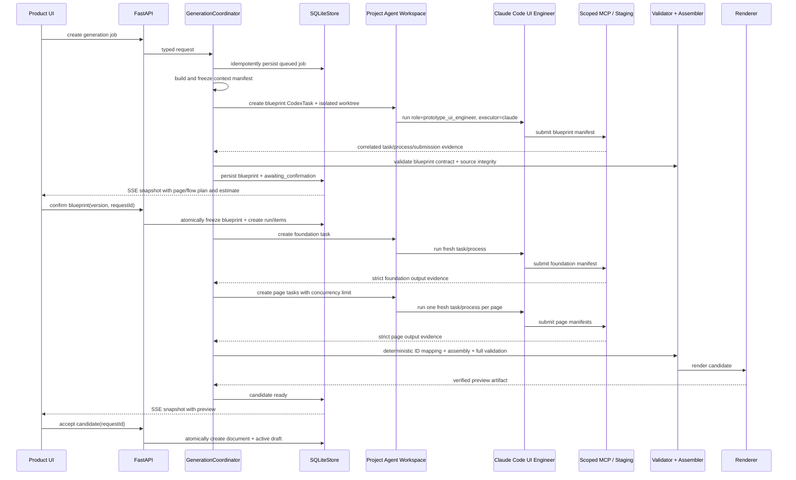
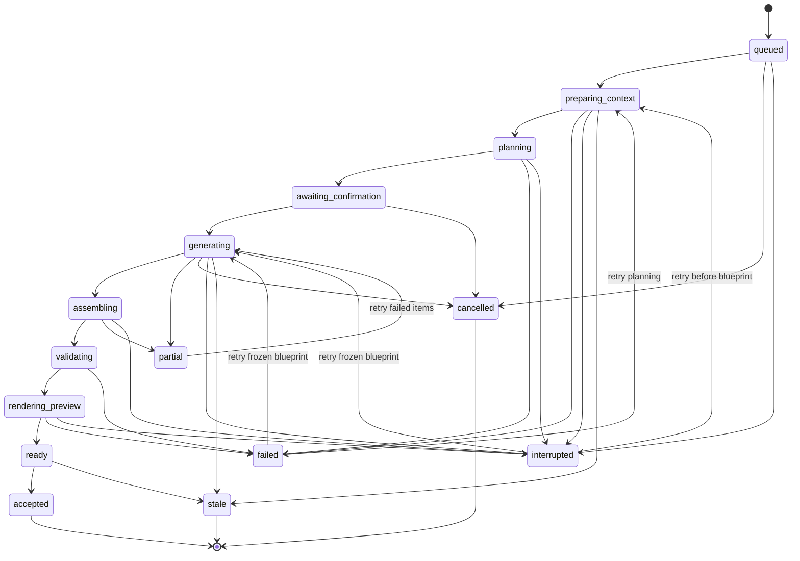
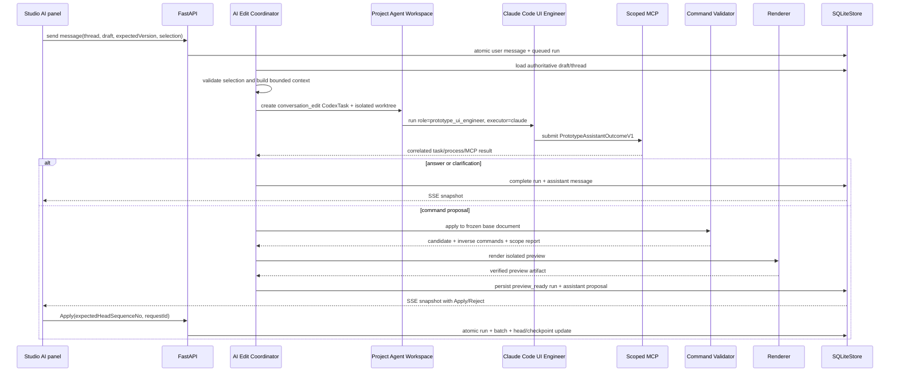

# 结构化原型 AI 生成详细设计

## 1. 设计目标

AI 生成分成两类，不能用一条“让 AI 返回完整 HTML”的链路同时承担：

1. **首次生成**：根据产品需求或已分析的项目源码，生成包含多页面、共享导航、组件体系和业务流程的首个结构化草稿。
2. **对话编辑**：在已有草稿上回答问题、请求澄清，或提出一个可预览、可应用、可拒绝的原子命令批次。

两类流程共享以下底线：

- AI 输出不是事实来源。只有经过严格 schema、语义、引用、范围和渲染校验的结构化结果才能进入候选状态。
- 首次生成不要求 UI Engineer 一次返回完整 `PrototypeDocument`；服务端从多个有界产物确定性组装文档。
- 对话编辑不接受完整文档替换，只接受领域命令。
- AI 不直接写 active draft，不直接推进 published revision，也不直接操作 SQLite。
- 产品后端只调用项目绑定的 Claude Code `prototype_ui_engineer`，不直接调用通用 LLM API。
- Claude Code 任务、文件写入和渲染都在数据库事务之外执行。
- Claude staging 只是受控提交入口。冻结 context、blueprint、foundation、page、candidate 和大型 submission 经严格校验后写入 managed content-addressed object store；SQLite 只保存状态、命令、hash 和 object reference。
- 每个 request/context/governance/task/process/submission/validation/repair/assembly/render/accept/apply 步骤都持久化 operation/step evidence；缺少完成证据不能进入下一阶段。
- 文档和 renderer 等确定性步骤必须可按 hash 重放。Claude 重跑创建新的 operation 并比较结果，不承诺再次生成相同输出。
- 任何失败都保留已有草稿和已发布版本。

存储与恢复细节见 [`checkpoint-journal-design.md`](checkpoint-journal-design.md)，步骤证据和 replay manifest 见 [`observability-reproducibility-design.md`](observability-reproducibility-design.md)，Claude capability/staging/MCP 和生成 artifact 的精确字段见 [`executable-contracts.md`](executable-contracts.md)。

## 2. 总体架构

```mermaid
flowchart LR
    REQ["产品需求"] --> COORD["AI Generation Coordinator"]
    REPO["已确认项目计划 / 仓库证据"] --> COORD
    CHAT["对话消息 / 结构化草稿选区"] --> COORD
    COORD --> WORKSPACE["Project prototype_ui_engineer workspace"]
    WORKSPACE --> TASK["Fresh CodexTask<br/>role=prototype_ui_engineer<br/>executor=claude"]
    TASK --> WT["Isolated worktree + scoped context"]
    WT --> SUBMIT["Scoped MCP / staged immutable JSON manifest"]
    SUBMIT --> CONTRACTS["Strict output contracts"]
    CONTRACTS --> VALIDATE["Schema + semantic + reference validation"]
    VALIDATE --> OBJECTS["Immutable content-addressed objects"]
    VALIDATE --> ASSEMBLE["Deterministic assembler"]
    ASSEMBLE --> RENDER["Versioned renderer"]
    OBJECTS --> ASSEMBLE
    RENDER --> CANDIDATE["Candidate preview + object hash"]
    CANDIDATE -->|"Accept"| DRAFT["Active structured draft"]
    DRAFT --> CONVERSATION["AI conversation"]
    CONVERSATION --> PATCH["Answer / clarification / command proposal"]
    PATCH -->|"Apply commands"| DRAFT
```



核心决策是“单项目 Agent 运行时、多任务协议、统一提交契约”：

| 场景 | Task kind | 冻结上下文 | 提交方式 |
|---|---|---|---|
| 纯需求生成 | `generation_blueprint` / `generation_foundation` / `generation_page` | brief、资源、页面提示、结构化 schema | 大型 JSON 写入任务专属 staging 后提交哈希清单 |
| 已有项目源码恢复 | 同上 | 已确认 plan、evidence IDs、repository fingerprint、只读源码范围 | 隔离 worktree 内检索；大型 JSON 通过 staging 清单提交 |
| 已有结构化草稿的局部编辑 | `conversation_edit` | 权威草稿切片、选区、线程消息、命令 schema | answer、clarification 或小型 command proposal 通过 scoped MCP 提交 |

每个项目拥有一个逻辑 `prototype_ui_engineer` workspace。每次 planning、foundation、page、repair 或 conversation 请求都创建新的 `CodexTask` 和 execution process，并使用任务专属隔离 worktree；不复用隐藏的 Claude 进程记忆。对话连续性来自后端持久化 thread/messages、冻结 context manifest 和当前结构化草稿。

Claude Code UI Engineer、项目 workspace、worktree、治理门或提交边界任一不可用时直接失败。所有 source mode 都禁止回退到通用 LLM API；repository mode 还必须拒绝任何无法验证仓库证据的执行。

## 3. 首次生成的输入来源

### 3.1 Requirements source mode

请求包含：

```text
project_id
client_request_id
source_mode = requirements
title
brief
output_locale
target_viewports
reference_asset_ids[]
optional_page_hints[]
```

`brief`、页面提示和资源都是外部输入，只在 interface 边界做长度、类型和资源归属校验。服务端不会把客户端提交的 JSON 子树当作文档上下文。

### 3.2 Repository source mode

请求包含：

```text
project_id
client_request_id
source_mode = repository_plan
prototype_plan_id
expected_plan_updated_at
selected_plan_item_ids[]
output_locale
```

创建 job 前必须满足：

- plan 为 `ready`。
- `expected_plan_updated_at` 与当前 plan 一致。
- 选中项属于该 plan，且处于可生成状态。
- 重新扫描得到的 repository fingerprint 与 plan 一致。
- 项目 `prototype_ui_engineer` workspace、Claude executor、隔离 worktree 和治理门全部可用。

任一条件失败都不创建 generation run。

### 3.3 生成目标

首次生成只创建一个新的结构化文档候选。向已有文档追加页面、重新设计整个文档或生成替代方案，首版都作为新的 generation job；已有文档上的局部变化走对话命令。

### 3.4 统一 Agent 入口

`source_mode` 只决定 Context Builder 装载什么证据，不决定调用哪个 AI。两种输入都进入同一个项目级 UI Engineer 入口：

```text
API request
  -> durable operation + generation job/run/item
  -> resolve project prototype_ui_engineer workspace
  -> create CodexTask(role=prototype_ui_engineer, executor=claude)
  -> start execution process in isolated worktree
  -> submit scoped MCP result or staged JSON manifest
  -> validate task/process correlation, contract, hashes and source integrity
  -> register immutable objects + per-step completion evidence
  -> assemble + render immutable candidate preview
  -> explicit Accept/Apply
```

任务指令、可读文件和提交 token 都按 job/run/item 限定。Claude Code 可以在其内部使用配置的模型，但后端不选择或调用供应商 LLM API，也不把供应商 stream frame 作为业务协议。

## 4. Plan-first 流程

首次生成必须先产生可审阅蓝图。蓝图不是完整页面，不包含 UI 节点树，只描述生成范围和跨页面约束。



蓝图确认是默认且不可跳过的产品步骤。它让产品经理在启动 foundation/page Agent tasks 之前确认：页面列表、路由、共享菜单、起始页和业务流程是否正确。首版不提供静默 `auto_confirm`。

## 5. 生成阶段

### 5.1 Freeze context

Context Builder 先构造一个冻结的 `GenerationContextManifest`：

```text
contract_version
source_mode
request_hash
project_id
project_evidence_fingerprint | null
plan_id | null
plan_updated_at | null
selected_evidence_ids[]
reference_asset_hashes[]
output_locale
context_builder_version
created_at
```

requirements mode 的 request hash 覆盖 brief、页面提示、viewport 和资源哈希。repository mode 额外覆盖 plan、选中项、evidence IDs 和 repository fingerprint。

Manifest canonicalize 后作为 `payload_type=generation_context_manifest` 的 immutable object 保存，job 记录 object hash。运行中的 job 永远读取冻结 manifest，不读取“最新 plan”或“最新资源列表”。接受候选前 repository mode 再次比对 fingerprint；源码已变化则 job 进入 `stale`。

### 5.2 Blueprint generation

`generation_blueprint` UI Engineer 任务只能提交 `GenerationBlueprintV1`：

```json
{
  "contractVersion": 1,
  "documentTitle": "采购协同平台",
  "productIntent": "管理采购申请、供应商和审批流程",
  "outputLocale": "zh-CN",
  "foundationIntent": {
    "visualLanguage": "quiet operational workspace",
    "density": "compact",
    "responsiveStrategy": "desktop-first with mobile drawers"
  },
  "pages": [
    {
      "pageKey": "purchase-requests",
      "title": "采购申请",
      "route": "/purchase-requests",
      "purpose": "查看并创建采购申请",
      "requiredStates": ["default", "empty", "loading"],
      "navigationGroupKey": "procurement"
    }
  ],
  "navigation": [],
  "flowIntents": [],
  "roleIntents": [],
  "entityIntents": [],
  "variableIntents": [],
  "formIntents": [],
  "viewBindingIntents": [],
  "behaviorIntents": [],
  "scenarioIntents": [],
  "startPageKeys": ["purchase-requests"]
}
```

蓝图校验包括：

- `pageKey`、navigation key 和 flow intent key 唯一且符合稳定技术标识规则。
- route 唯一、规范化且不包含外部 URL。
- 所有 navigation 和 flow 引用的 page key 存在。
- 至少一个起始页，且全部属于 pages。
- 页面数、流程数和状态数不超过配置上限。
- 每个 view/behavior intent 只引用已声明的 page/role/entity/variable/form/scenario technical keys；view target/node/value 类型在 blueprint 层可验证。
- 每个 scenario intent 有角色、起始页、确定性 fixture/fixed clock 和 expected milestones；至少一个主 scenario 声明可编译的 scripted behavior-intent sequence。
- repository mode 的每个选中 plan item 都被一个 page 映射，不能无证据增加产品能力。

Blueprint 进入 `awaiting_confirmation` 后可以通过类型化 plan commands 修改：

- `addPlannedPage`
- `removePlannedPage`
- `renamePlannedPage`
- `setPlannedRoute`
- `reorderPlannedPage`
- `updatePlannedNavigation`
- `connectPlannedFlow`
- `disconnectPlannedFlow`
- `setPlannedStartPages`
- `add|replace|removePlannedRole`
- `add|replace|removePlannedEntity`
- `add|replace|removePlannedVariable`
- `add|replace|removePlannedForm`
- `add|replace|removePlannedViewBinding`
- `add|replace|removePlannedBehavior`
- `add|replace|removePlannedScenario`

每次修改增加 `blueprint_version`。Confirm 必须携带 `expected_blueprint_version`，并在事务中冻结 `blueprint_hash`。

### 5.3 Foundation generation

Foundation 是串行阶段，成功后才启动页面并行生成。它产生所有页面共享的设计约束：

```text
GenerationFoundationV1
  contractVersion
  tokenSet
  componentDefinitions[]
  sharedShell
  navigationDefinition
  contentConventions
```

Foundation 不包含任意页面 root。后续 `generation_page` 任务只能引用已冻结的 tokens 和 component definitions，不能在各页面中重新定义颜色体系、导航外壳或同名组件。

repository mode 必须以项目现有布局、tokens、组件和资源为证据；requirements mode 按产品类型创建克制、可读的默认 foundation。

### 5.4 Page generation

每个 blueprint page 是独立 run item，输入只包含：

- 冻结 blueprint 中该 page 的定义。
- 冻结 foundation。
- 与该 page 直接相关的 navigation 和 flow intents。
- 与该 page 直接相关的 form/behavior intents；跨页面 rule 仍以 blueprint intent 为边界。
- repository mode 下该 page 的证据/源码边界或 UI Engineer 可读取目标。
- 文档 schema、节点类型和限制版本。

页面输出为 `GeneratedPageV1`：

```json
{
  "contractVersion": 1,
  "pageKey": "purchase-requests",
  "title": "采购申请",
  "route": "/purchase-requests",
  "viewport": {"defaultWidth": 1440},
  "root": {
    "type": "Stack",
    "localKey": "page-root",
    "children": []
  },
  "formBindings": [],
  "viewBindings": [],
  "behaviorBindings": [
    {
      "sourceNodeKey": "create-request-button",
      "event": "click",
      "behaviorIntentKey": "open-create-request"
    }
  ]
}
```

UI Engineer 只生成 job 内的 `localKey`，不生成持久化 entity ID。服务端用 `job_id + entity_kind + localKey` 做确定性 ID 映射：

- 同一 job 重试得到相同 localKey 时映射到相同 entity ID。
- 同一作用域 localKey 冲突时拒绝页面输出。
- 跨页面引用只能使用 blueprint 预先定义的 page/navigation/flow/form/behavior intent key。

并行度默认 2，与现有 prototype generation 全局并发约束一致。Foundation 失败时不启动任何 page item。

### 5.5 Deterministic assembly

Assembler 是纯应用逻辑，不调用 Claude Code 或任何模型 API：

1. 校验每个 blueprint page 恰好有一个成功 page output。
2. 将 local keys 映射成稳定 entity IDs。
3. 注入 foundation、shared shell 和 canonical navigation。
4. 将 form/view/behavior bindings 解析为稳定 IDs，并编译 typed view expressions、trigger/guard/effects。
5. 组装 roles、variables、mock entity schemas、forms、view bindings、rules、scenarios、pages、flow projections 和 asset refs。
6. 用 pinned runtime core 为每个 scenario 创建 initial state；对 scripted 主场景执行 event batches 并逐步验证 milestone predicates/hashes。
7. canonicalize JSON 并计算 candidate hash。
8. 运行完整 document/runtime/reference 校验。

UI Engineer 不能在 assembly 阶段“补齐”缺失页面或引用。任何缺失项都让 job 进入 `partial` 或 `failed`。

### 5.6 Validation and bounded repair

校验分四层，责任不能重复：

| 层 | 所有者 | 内容 |
|---|---|---|
| Agent task boundary | UI Engineer runtime adapter | task/process 终态、唯一提交、task-token correlation、字节/运行时限制 |
| Schema | Pydantic application model | discriminator、字段类型、extra forbid、长度/数量 |
| Semantic | generation validator | ID、布局、组件 slot、navigation、flow、scope、asset 引用 |
| Runtime | pinned runtime core | value/predicate/effect 类型、scenario initial state、rule/node bindings |
| Render preflight | renderer | renderer/runtime 版本支持、CodeBlock sandbox、静态产物可生成 |

自动 repair 只允许一次，并且只针对“输出完整、schema 可解析、错误归属到单个 foundation/page item”的语义错误。例如未知 component slot 或某个 flow intent 未绑定。

以下错误禁止 repair，直接结束本次 attempt：

- Claude task/process 没有成功终态或非正常退出。
- Agent 输出达到运行时限制而截断。
- MCP finalization 或 staging manifest 缺失、重复或不是预期 contract。
- JSON/工具参数结构不完整。
- repository fingerprint 变化。
- 治理门、运行时或存储不可用。
- 违反安全边界或超出硬限制。

Repair 是新的 `semantic_repair` CodexTask attempt，记录原 validation error codes 和被修复的 item。第二次仍失败则 job 进入 `partial`/`failed`，等待用户显式 Retry。

### 5.7 Preview and accept

只有 assembled document 通过完整校验、写入 `payload_type=prototype_document` 的 immutable object、以 `generation_candidate` role 建立引用并 read-back 成功后才创建 `ai_preview` render run。Preview artifact 记录 candidate object/document hash 和 renderer version。

Candidate object 写入和 preview render 都在 SQLite 事务外；每一步记录 input/output hash、assembler/validator/renderer version 和 completion evidence。文件成功、DB 引用失败时产生安全 orphan，由延迟 GC 处理。

Accept 使用一个 `BEGIN IMMEDIATE`：

1. 校验 job 为 `ready`，且未被接受/取消。
2. 校验 candidate object hash、preview artifact document hash 和 renderer version 一致，并重新 read-back object。
3. 对 repository mode 再次校验冻结 fingerprint 未过期。
4. 根据请求创建 `prototype_documents` 行。
5. 为 candidate object 创建 `generation_accept` checkpoint，并创建首个 `active` draft，`base_revision_no=null`、`head_sequence_no=0`。
6. 写入 draft object/asset references。
7. job 标记为 `accepted` 并关联 `document_id`。
8. 写入 operation completion evidence、replay manifest reference 和幂等结果并提交。

生成候选不会直接创建 revision。产品经理进入 Studio 后仍可拖拽、对话调整，显式 Publish 才创建 revision 1。

## 6. 首次生成状态模型

### 6.1 Job state



`partial` 表示至少一个 foundation/page item 未完成，但已有成功输出可在 Retry 中复用。Partial output 只能展示进度和诊断，不能成为 active draft，也不能产生分享链接。

### 6.2 Run and item state

Confirm blueprint 创建 generation run。Retry 创建新 run，引用同一个 job 和 frozen blueprint hash，只包含失败/中断 items；旧 run 保持终态。

```text
GenerationRun.status
  queued | running | completed | partial | failed | interrupted | cancelled

GenerationRunItem.kind
  foundation | page

GenerationRunItem.status
  pending | generating | validating | done | failed | interrupted | skipped

GenerationRunItem.phase
  queued | preparing | running | validating | repairing | completed | failed | interrupted
```

Assembly 从同一 job 的 run chain 中选择每个 blueprint item 最新的成功输出。成功输出和 contract version 不变时无需重新生成。

## 7. 首次生成持久化

大型 JSON 不进入下列表。完整 request/context/blueprint/foundation/page/candidate/submission 都先成为 [`checkpoint-journal-design.md`](checkpoint-journal-design.md) 定义的 immutable object；SQLite 行保存 object hash、状态和关联证据。

### 7.1 prototype_document_generation_jobs

```text
id
project_id
document_id | null
client_request_id
source_mode
status
operation_id
request_manifest_object_hash
request_hash
context_manifest_object_hash | null
blueprint_object_hash | null
blueprint_version
blueprint_hash | null
candidate_object_hash | null
candidate_document_hash | null
preview_render_run_id | null
replay_manifest_object_hash | null
estimated_cost_usd | null
actual_cost_usd | null
error_code | null
error_message | null
created_at
updated_at
completed_at | null
```

约束：`UNIQUE(project_id, client_request_id)`；partial unique index 保证每个 project 最多一个非终态 job。同一请求重试返回原 job。

### 7.2 prototype_document_generation_runs

```text
id
job_id
retry_of_run_id | null
status
blueprint_hash
operation_id
total
processed
succeeded
failed
running
pending
error_code | null
error_message | null
started_at | null
completed_at | null
created_at
updated_at
```

### 7.3 prototype_document_generation_run_items

```text
id
run_id
job_id
kind
item_key
page_key | null
status
phase
attempt
task_kind
agent_role
runtime_profile
runtime_profile_hash
executor_id
claude_code_version
executor_adapter_version
prompt_version
contract_version
document_schema_version
command_contract_version
runtime_schema_version
runtime_core_version
state_machine_kernel_version
context_builder_version
canonicalizer_version
validation_ruleset_version
mcp_tool_contract_version
final_runtime_wire_input_hash
worktree_base_commit
source_fingerprint | null
context_object_hash
submission_object_hash | null
candidate_output_object_hash | null
output_object_hash | null
output_hash | null
validation_report_object_hash | null
replay_manifest_object_hash | null
task_id | null
execution_process_id | null
input_tokens | null
output_tokens | null
cost_usd | null
error_code | null
error_message | null
last_event_at | null
started_at | null
completed_at | null
created_at
updated_at
```

约束：`UNIQUE(run_id, kind, item_key)`。完整且 schema-valid、但 semantic-invalid 的结果保存为受 retention 约束的 candidate object，供一次受限 repair 使用；只有全部 item validation 成功后才设置 `output_object_hash`。task/process 成功但 object、validation report 或 completion evidence 缺失时 item 仍失败。

### 7.4 prototype_document_generation_blueprint_batches

记录用户对 awaiting-confirmation blueprint 的类型化修改和逆命令：

```text
id
job_id
sequence_no
client_request_id
expected_blueprint_version
commands_json
inverse_commands_json
command_batch_hash
base_blueprint_hash
result_blueprint_hash
operation_id
created_at
```

Blueprint 当前物化结果保存为 immutable `generation_blueprint` object；batch 仍是 SQLite 中的小型 typed command。Blueprint patch、Confirm、Cancel、Retry 和 Accept 都必须拥有 client request ID，并由 store 事务保证跨进程幂等。

### 7.5 Object write and reference ordering

每个 Claude staged artifact 按以下固定顺序处理：

```text
task/process terminal correlation
  -> staging path/size/UTF-8/submission hash validation
  -> strict schema + semantic validation
  -> canonicalize/compress/write/fsync/read-back object
  -> SQLite object descriptor + owner reference + step evidence
  -> staging cleanup
```

SQLite 不能先记录“成功”再等待对象写入。对象成功而 DB 失败留下 orphan；DB 不能引用缺失或未 read-back 的 object。Retry 可以复用 hash 一致且有完整 owner/completion evidence 的成功 object，不从 Agent trajectory 或 stdout 重建。

## 8. 对话线程设计

AI 对话不是一个只有 instruction 的临时请求。它需要持久化可见消息、运行状态和应用结果，但不能把聊天记录当作当前原型状态。

### 8.1 PrototypeAiThread

```text
id
document_id
title
status: active | archived
summary_json
summary_through_message_id | null
created_at
updated_at
```

Thread 属于 document，不属于某个 draft，因此发布后仍保留。每个 edit run 仍固定到发起时的 draft ID、base revision、base head sequence/document hash 和 context manifest object hash。

### 8.2 PrototypeAiMessage

```text
id
thread_id
client_message_id | null
role: user | assistant
kind: instruction | answer | clarification | proposal | error
content
run_id | null
command_batch_id | null
status: pending | completed | failed
created_at
updated_at
```

一个 user message 和 queued run 在同一个事务创建。Assistant message 只在项目 UI Engineer 提交严格结果后写为 completed；失败时写安全错误说明，并保留 user message。

User message 使用 `UNIQUE(thread_id, client_message_id)` 保证网络重试不会重复创建 Claude Code 任务；assistant message 没有 client message ID。

`summary_json` 只是 token 管理缓存，记录参与摘要的 message IDs。文档、已应用 command batches 和 revisions 才是事实来源。摘要失败不会改变文档，也不会让服务端猜测历史；Context Builder 可以只使用当前文档和预算内最近消息。

### 8.3 用户消息输出类型

`conversation_edit` UI Engineer 任务必须通过 scoped MCP 提交 `PrototypeAssistantOutcomeV1` discriminated union：

```json
{
  "contractVersion": 1,
  "kind": "commandProposal",
  "message": "已准备调整采购申请表格和新增按钮。",
  "summary": "移动按钮并增加负责人列",
  "commands": []
}
```

允许三种 kind：

- `answer`：只回答问题，不产生候选文档。
- `clarification`：信息不足时提出一个具体问题，不产生候选文档。
- `commandProposal`：包含摘要和命令，进入完整校验与预览流程。

UI Engineer 不能用 `answer` 声称已经修改文档。只有 `commandProposal -> preview_ready -> applied` 才算完成修改。

## 9. 对话编辑流程



### 9.1 Selection contract

客户端只提交选择标识，不提交节点内容：

```text
scope: selection | page | document | flow
page_id | null
selected_node_ids[]
flow_id | null
viewport
```

服务端从 active draft 重新加载实体并构造 AI 上下文。默认 scope 为 selection；没有选中节点时默认 page。以下操作需要显式扩大 scope：

- `updateNavigation`：document。
- 新增/删除页面或全局 token：document。
- 跨页面连接：flow 或 document。
- `replaceCodeBlockPayload`：selection，且恰好选择一个 CodeBlock。

提案中的每个 command 都经过 scope validator。UI Engineer 越权引用其他实体时整个提案失败，不截掉越权命令后继续。

### 9.2 Context slicing

对话 UI Engineer 任务默认接收：

1. document/command/runtime/renderer contract 和 runtime-core versions。
2. 当前 document/draft hash 和 output locale。
3. 当前 page 摘要。
4. 选中节点子树、必要 ancestor layout chain 和相邻节点摘要。
5. 被引用的 component definitions、tokens 和 assets 元数据。
6. 直接相关的 navigation/flow intents。
7. 直接相关的 runtime roles/variables/entities/forms/rules/scenarios；若用户引用 recorded session，再加入指定 transition report hash/slice。
8. 当前 thread 在 token 预算内的最近可见消息。
9. 用户新消息和明确 scope。

它不默认接收：整份项目源码、整份多页文档、其他 thread、未选择 CodeBlock 的 payload、资源二进制、凭据或服务端路径。

Context manifest 包含 page/node/component/flow/message IDs、各自 hash、base sequence/document hash、context builder/prompt/schema/command versions 和总 token estimate。它作为 `payload_type=ai_edit_context_manifest` 的 immutable object 保存，run 只保存 object hash。它是可重现上下文清单，不是 prompt 文本副本。

### 9.3 Command validation

命令批次依次经过：

- command contract validation。
- scope validation。
- 在冻结 base document object 上的纯函数应用。
- 节点/组件/布局/引用完整性校验。
- runtime value/predicate/effect、form binding、scenario 和 BehaviorRule/Flow projection 校验。
- pinned runtime core definition validation 和所有 scenario initial-state hash 生成。
- 文档大小和节点数量限制。
- CodeBlock 与 asset 安全边界。
- renderer preflight 和隔离 preview render。

所有命令原子处理。不存在“前 4 条成功、第 5 条失败但保留前 4 条”的结果。

### 9.4 Apply and Reject

Apply 继续遵守总后端设计的一个事务边界：校验 preview_ready、base sequence/hash、proposed command batch hash、candidate object hash 和 preview hash，插入一个 `origin=ai` immutable batch，推进 draft head/refs，把 candidate object 注册为 result sequence checkpoint，并把 run 标为 applied。

Reject 只把 run 标为 rejected，并更新 assistant proposal 状态；draft、undo history 和 document hash 均不变化。

如果 AI 运行或用户审阅期间 draft head sequence/hash 变化：

- 未完成 run 在写 preview_ready 前变为 `stale`。
- 已经 preview_ready 的 run 在 Apply 时变为 `stale` 并返回 409。
- 首版不自动 rebase；用户可以在最新选择上重新发送消息。

## 10. AI edit run 状态

```text
queued
building_context
generating
validating
rendering_preview
preview_ready
completed_answer
completed_clarification
applied
rejected
stale
failed
interrupted
```

终态为：`completed_answer`、`completed_clarification`、`applied`、`rejected`、`stale`、`failed`、`interrupted`。

Restart recovery：

- queued/building_context/generating/validating/rendering_preview -> interrupted。
- preview_ready 保留；Apply 时重新检查 draft head sequence/document hash、candidate object 和 preview artifact。
- 已完成 answer/clarification/message 保留。
- 不自动重复 Claude task/process；Retry 创建新 run 和新的 CodexTask，并链接 `retry_of_run_id`。

## 11. Claude Code UI Engineer 调用协议

### 11.1 Agent runtime abstraction

Application 层只依赖项目 Agent 运行时，不依赖通用模型 client：

```text
PrototypeUiEngineerRuntime
  execute(PrototypeUiEngineerTaskRequest) -> PrototypeUiEngineerTaskResult
  cancel(task_id, execution_process_id)

PrototypeUiEngineerTaskRequest
  project_id
  project_workspace_id
  operation_id
  step_id
  job_id | edit_run_id
  run_id
  item_id
  task_kind
  frozen_context_object_hash
  frozen_context_materialization_path
  expected_submission_contract
  scoped_submission_config
```

Runtime adapter 复用现有任务基础设施，为每个 request 创建 `CodexTask(role="prototype_ui_engineer", executor="claude")`、隔离 worktree 和 execution process。返回结果必须带 task/process identity、明确终态和提交证据；application service 不解析 Claude stdout 里的自然语言，也不接触供应商私有 stream frame。

`CodexTask` 是仓库中现有的通用任务领域模型名称，不代表使用 Codex executor；本流程的 `executor` 固定为 `claude`。

大型 blueprint、foundation 和 page JSON 使用任务专属 staging 文件。Staging 在任务结束和严格校验后必须转成 managed immutable object，不能作为长期读取路径。UI Engineer 最终只提交 compact manifest：

```text
contract_version
job_id
run_id
item_id
artifact_path
sha256
byte_size
complete
```

服务端还记录 submission manifest hash、转存后的 object hash 和两者内容一致性证据。后续 assembly/retry 只读取 object store，不读取已清理的 worktree staging path。

小型 `PrototypeAssistantOutcomeV1` 和 staging finalization 使用 scoped MCP：

- `submit_prototype_assistant_outcome`
- `finalize_prototype_blueprint`
- `finalize_prototype_foundation`
- `finalize_prototype_page`

MCP session token 绑定 project/job/run/item/task/contract、仅允许 loopback、短期有效，task 结束立即撤销。Staging path 绑定同一个 item，禁止 symlink、路径逃逸、覆盖已有产物和跨任务读取。MCP 工具和 staging manifest 都不能读取或修改其他 job、draft 或 project。

### 11.2 Task kinds and continuity

```text
generation_blueprint
generation_foundation
generation_page
conversation_edit
semantic_repair
```

每个 task kind 使用独立 prompt、context schema、提交 contract 和权限范围。项目 workspace 提供角色、仓库和工具配置的逻辑连续性；业务对话连续性只来自数据库中的 thread/messages、当前 draft 和冻结 context manifest。服务端不得依赖 Claude session resume、进程内聊天记录或未持久化的 Agent 记忆恢复任务。

### 11.3 Prompt layering

Prompt 由明确版本的层组成：

1. 安全和角色 policy。
2. 输出 contract 与 hard limits。
3. foundation/document/runtime schema 摘要。
4. 冻结 context。
5. page/selection scoped data。
6. 用户指令。

`prompt_version`、`contract_version`、`context_builder_version` 和 `runtime_profile` 全部固化在 run item。运行中配置变化不影响已冻结 item。

Repository source、用户 brief、聊天消息和 CodeBlock 都被视为不可信数据。UI Engineer 在这些内容中看到的“忽略规则”“调用其他接口”等文本没有额外权限；最终只允许通过绑定当前 task 的 staging/MCP 边界提交严格结果。

### 11.4 Completion proof

成功必须同时满足：

- `CodexTask` 和对应 execution process 都具有明确成功终态，且 identity 与当前 run item 一致。
- 恰好一个预期 MCP finalization 或 staging manifest。
- contract version 正确。
- strict schema validation 通过。
- runtime/output 未超过硬限制。
- staging 文件 path、size、SHA-256、UTF-8、completeness 校验通过。
- task/process correlation、source fingerprint 和无源码修改校验通过。
- submission 已转存为 read-back 成功的 immutable object，operation step 的 input/output hash、版本和完成证据已持久化。

Claude stdout 文本看起来完整、日志中出现 JSON、Agent 声称成功或生成了部分文件，都不能替代这些证据。

## 12. 预算、限额与并发

所有值通过 `application/timeouts.py` typed accessor 读取。建议首版默认值：

| 限制 | 默认值 |
|---|---:|
| blueprint 页面数 | 20 |
| 文档总节点数 | 2,000 |
| 单页节点数 | 500 |
| 最大节点深度 | 32 |
| component definitions | 50 |
| flow intents | 100 |
| runtime roles | 20 |
| runtime variables | 100 |
| mock entity schemas | 30 |
| runtime forms | 50 |
| runtime view bindings | 300 |
| behavior rules | 300 |
| runtime scenarios | 30 |
| predicate depth/nodes | 8 / 50 |
| effects per rule | 20 |
| 单 CodeBlock payload | 128 KiB |
| 页面生成并发 | 2 |
| 同项目活跃 generation job | 1 |
| 自动语义 repair | 每 item 1 次 |
| 用户显式 retry | 每 item 2 次 |
| generation job 最大运行时间 | 20 分钟 |

成本门执行两次：

1. Planning 前检查固定 Claude task 预算、项目 workspace 和 runtime 可用性。
2. Confirm blueprint 前，根据 foundation task、页面 task 数和预留一次 repair 计算 estimate 并检查总预算。

治理门报错等同拒绝动作。页面数超过预算时要求用户删减 blueprint；不能静默减少页面或更换低成本运行配置后继续。

## 13. Cancel、Retry 和并发

### Cancel

- Cancel 先在事务中把 job/run 标为 cancelled，再请求停止正在运行的 Claude task/process。
- 已经发出的外部调用即使晚到，也必须在持久化前重新检查 job 状态；cancelled 输出只能进入 trace，不能进入 candidate。
- Cancel 不创建 document 或 draft。

### Retry

- Planning 失败：创建新的 planning attempt，复用冻结 request/context；repository fingerprint 变化则拒绝并要求新 job。
- Partial page generation：新 run 只包含 failed/interrupted items，复用成功 foundation/page outputs。
- Render failure：重试相同 candidate hash 和固定 renderer version，或由用户明确选择新版 renderer 创建新 preview run。
- AI edit retry：新 run 重新读取当前 draft；原提案不自动搬到新版本。

### Concurrent requests

- 同一 `client_request_id` 返回同一结果。
- 同项目最多一个 active generation job，限制由 SQLite partial unique index 或事务 gate 保证。
- 同一 draft 最多有一个 active AI run；新消息在前一 run 完成前返回 409，首版不跨 thread 排队多个对话请求。
- 用户仍可在 AI 生成期间拖拽编辑；这会让旧提案 stale，而不是阻塞编辑器。

## 14. SSE 和前端快照

首次 generation job、generation run 和 AI edit run 都提供 GET snapshot 与 SSE：

```text
event: snapshot
  contractVersion
  resourceId
  operationId
  eventNo
  status
  phase
  updatedAt
  progress
  blueprint | null
  candidatePreview | null
  assistantMessage | null
  proposal | null
  error | null

event: heartbeat
  contractVersion
  resourceId
  operationId
  lastEventNo
  sentAt
```

首版不把 Claude stdout、过程消息或 token delta 作为恢复协议。UI 显示持久化 phase、页面进度和完成后的完整 assistant message。这样刷新、断线和后端重启后都能从同一 snapshot 恢复。

Snapshot 必须包含：

- generation：总页面、processed/succeeded/failed/running/pending、当前页面标题、blueprint version、估算成本、最新 run ID。
- AI edit：thread/message/run/operation IDs、base head sequence/document hash、scope、状态、summary、受影响实体 IDs、candidate/preview hashes、可否 Apply/Reject。

SSE 是 durable operation events 的投影视图，不是独立事实来源。前端按 `resourceId + operationId + eventNo` 去重和拒绝错序；重连后先 GET 持久化 snapshot。

## 15. 错误码

稳定 error code 至少包括：

```text
runtime_unavailable
governance_unavailable
budget_exceeded
context_invalid
context_stale
repository_fingerprint_stale
agent_task_timeout
agent_task_failed
agent_terminal_missing
submission_missing
submission_duplicate
staging_manifest_invalid
contract_version_unsupported
schema_invalid
semantic_invalid
scope_violation
reference_invalid
limit_exceeded
source_integrity_failed
preview_render_failed
draft_conflict
job_cancelled
restart_interrupted
object_write_failed
object_hash_mismatch
object_missing
observability_unavailable
completion_evidence_missing
replay_manifest_missing
replay_mismatch
```

用户可见错误信息本地化，数据库和日志使用稳定 code。Exception、task prompt、Agent 原始输出、CodeBlock 和源文件内容不进入普通 API error detail。

## 16. 安全、可观测与复现

### Project Claude Code UI Engineer

- 所有 source mode 和 conversation edit 都使用隔离 worktree、冻结 context/source fingerprint 和 scoped MCP/staging 权限。
- INFO 只记录 job/run/item、task/process identity、task kind、runtime profile、阶段、耗时、runtime 暴露的 usage/cost 和结果 code。
- 成功前校验 HEAD、status、diff 和受保护源文件 hash 未变化。
- 完整 Agent trajectory 保存在现有 task/message/log/trace 系统中，但它只用于审计，不是生成成功证据。
- MCP 接口不接收控制台主 token，不允许非 loopback 请求；Claude 配置、凭据和完整 task prompt 不写普通日志。
- 产品服务没有通用 LLM provider adapter 或静默 fallback；Claude runtime 不可用时返回 `runtime_unavailable`。
- 每个 Agent task/process 都绑定 operation/step，保存 request/context/prompt/runtime profile/submission/validation hashes 和精确版本。终态成功必须有 replay manifest。
- Claude 历史结果通过 frozen context object + exact submission object 还原。再次调用 Claude 是新的 diagnostic operation，输出只做结构化比较，不宣称必然与原输出一致。

### Candidate and preview

- AI candidate object 受 2 MiB canonical document 上限约束；上限与 SQLite 列无关。
- Preview 使用 sandbox/CSP 和 immutable artifact。
- CodeBlock 只能通过 `replaceCodeBlockPayload` 修改被选中的单个 block，并继续接受 payload size、network 和 host-runtime 校验。
- 资源只通过 asset ID 引用；UI Engineer 不能提交磁盘路径或外部任意 URL。

完整步骤矩阵、durable operation/event 字段、SSE event identity 和 deterministic replay/Claude diagnostic rerun 的区别以 [`observability-reproducibility-design.md`](observability-reproducibility-design.md) 为准。

## 17. API 契约

### Initial generation

| Method | Path | 作用 |
|---|---|---|
| `POST` | `/api/projects/{project_id}/prototype-document-generation-jobs` | 创建 requirements/repository job |
| `GET` | `/api/prototype-document-generation-jobs/{job_id}` | 获取 job 完整快照 |
| `GET` | `/api/prototype-document-generation-jobs/{job_id}/events` | snapshot + heartbeat |
| `POST` | `/api/prototype-document-generation-jobs/{job_id}/blueprint-batches` | 原子修改待确认蓝图 |
| `POST` | `/api/prototype-document-generation-jobs/{job_id}/confirm` | 冻结蓝图并创建 generation run |
| `POST` | `/api/prototype-document-generation-jobs/{job_id}/retry` | 重试 planning 或失败 items |
| `POST` | `/api/prototype-document-generation-jobs/{job_id}/cancel` | 取消未完成 job |
| `POST` | `/api/prototype-document-generation-jobs/{job_id}/accept` | 候选转为 document + active draft |
| `GET` | `/api/prototype-document-generation-runs/{run_id}` | 获取 run/items 快照 |

### Conversation

| Method | Path | 作用 |
|---|---|---|
| `POST` | `/api/prototype-documents/{document_id}/ai-threads` | 创建 thread |
| `GET` | `/api/prototype-documents/{document_id}/ai-threads` | 列出 thread |
| `GET` | `/api/prototype-ai-threads/{thread_id}` | thread + messages |
| `POST` | `/api/prototype-ai-threads/{thread_id}/messages` | 创建 user message + edit run |
| `GET` | `/api/prototype-ai-edit-runs/{run_id}` | edit run snapshot |
| `GET` | `/api/prototype-ai-edit-runs/{run_id}/events` | snapshot + heartbeat |
| `POST` | `/api/prototype-ai-edit-runs/{run_id}/apply` | 原子应用 proposal |
| `POST` | `/api/prototype-ai-edit-runs/{run_id}/reject` | 拒绝 proposal |
| `POST` | `/api/prototype-ai-edit-runs/{run_id}/retry` | 基于当前 draft 创建新 run |

所有 POST 必须使用严格 request model 和 `client_request_id`。不存在 `dict[str, object]` 请求体。

## 18. 事务边界

| Store operation | 同一事务内 |
|---|---|
| create generation job | 幂等检查 + operation + queued job + request object ref + created event |
| save blueprint | attempt precondition + blueprint object ref/version/hash + job awaiting_confirmation + step evidence |
| patch blueprint | version compare + immutable batch/inverse/hash + result blueprint object ref + operation evidence |
| confirm blueprint | request idempotency + freeze object/hash + run + all items + job generating + event |
| complete item | validated output object ref/hash/status + validation/replay refs + run counters + completion evidence |
| mark candidate ready | job/run precondition + candidate object/preview refs + hashes + ready event |
| accept candidate | job precondition + document + sequence-0 checkpoint/draft + object/asset refs + job accepted + replay/request result |
| create AI message | thread/document/draft head precondition + operation + user message + queued run |
| save AI proposal | run/base sequence/hash precondition + command/candidate/preview refs + assistant message + evidence |
| apply AI proposal | head compare + immutable batch/inverse + head/checkpoint refs + run/message applied + replay/request result |
| cancel | job/run state + cancelled event + request result；外部 cancel 在提交后执行 |

所有 Claude task/process、worktree 操作、object 写入/read-back、context build、校验、assembly 和 render 都在事务外；最终 store operation 重新检查 frozen hash、状态和 object descriptor。每个阶段在进入下一阶段前必须已有 durable completion evidence。

## 19. 最小测试矩阵

### Contract tests

- Blueprint/foundation/page/outcome 对 extra fields、未知 discriminator、重复 key、超限数组和错误 contract version 全部拒绝。
- localKey 在重试中映射稳定，冲突时拒绝。
- repository blueprint 必须覆盖全部选中 evidence items，不能添加无证据页面。
- Runtime intent 对未知 technical key、字符串表达式、未知 effect、真实 URL/network action 和无 scenario 起点全部拒绝。

### Workflow tests

- Blueprint 未确认时不会创建 foundation/page run items。
- Foundation 失败时页面生成不启动。
- 页面并发不超过配置；成功 sibling 不因一个页面失败而丢失。
- Partial job 不能 accept；retry 只生成失败 items。
- 全部页面完成后 assembly 相同输入产生相同 candidate hash。
- 相同 blueprint/page bindings + runtime core version 产生相同 rules、scenario initial-state hashes 和 candidate hash。
- Candidate accept 原子创建 document、sequence-0 checkpoint/draft、object/asset refs 和 replay manifest reference。

### Failure tests

- Agent task 异常结束、输出截断、missing/duplicate submission 不触发 auto repair。
- 单页语义错误最多一次 auto repair，并产生独立 attempt evidence。
- repository fingerprint 在 planning、generation、accept 三个边界变化都 fail closed。
- Cancel 后晚到 Agent submission 不写入 candidate。
- 重启把活动 job/run/item/edit run 标为 interrupted，已成功 item 和 preview_ready proposal 保留。

### Conversation tests

- answer/clarification 不改变 draft head sequence/hash。
- proposal 越过 selection scope 时整个 batch 拒绝。
- 用户在 Agent task 运行期间编辑 draft，proposal 变 stale。
- 同一 message/apply/reject request ID 不重复写消息或命令。
- Reject 不写 command batch，Apply 写一个 origin=ai batch 并支持 Undo。
- Runtime/flow proposal 只能提交 typed runtime commands；越权修改未加载 rule/scenario/session trace 时整批拒绝。

### Security/observability tests

- UI Engineer 无法使用过期/其他 item 的 MCP token 或 staging path。
- 非 loopback MCP、源码修改、路径逃逸和 source hash 不一致均拒绝。
- Trace 保留完整 task/process/Agent 证据；INFO/audit validation payload 不包含 prompt、文档或 CodeBlock。
- Requirements、repository 和 conversation edit 均创建 `executor=claude` 的项目 UI Engineer task；测试环境若发现 generic LLM client 被调用则失败。
- 治理门异常返回 unavailable，不启动任何外部调用。
- 每个 state-changing request 能由 operation ID 查询 steps/events；成功效果必须有 replay manifest，副作用前失败必须有 failure evidence。只有日志或 trajectory 时测试失败。
- staging 成功但 object registration 失败只留下 GC orphan；DB 不引用未 read-back object。
- 同一成功 generation items + assembler version 在隔离进程重放得到相同 candidate hash；同一 document object + renderer version 得到相同 output hash。
- Claude diagnostic rerun 创建新 operation 并产生 comparison report，不覆盖原 submission，也不要求新 output hash 相同。
- Generation candidate 的每个 scenario 都通过 pinned runtime core validation；browser/backend shared fixtures 的 state hash 不一致时不能 candidate ready。

## 20. 实施顺序

1. 定义 object/canonicalizer、operation/step/event/replay manifest、blueprint/foundation/page/runtime intent/outcome 的 strict contracts 和纯 validator。
2. 实现 managed object writer/read-back、object references/GC 与 generation job/run/item/operation store 事务、幂等和 recovery。
3. 实现 `PrototypeUiEngineerRuntime`，复用项目 workspace、`CodexTask`、Claude executor、隔离 worktree、scoped MCP 和 staging-to-object 边界。
4. 实现 requirements/repository 两种 context protocol 与 plan-first API，统一创建有逐步 evidence 的 `generation_blueprint` Agent task。
5. 实现 foundation/page Agent tasks、runtime bindings、deterministic assembler、pinned runtime validation、candidate object 和 versioned preview。
6. 实现 candidate accept 到 document/sequence-0 checkpoint/draft 的原子事务。
7. 实现 thread/message、context slicing/object、`conversation_edit` task、answer/clarification/proposal 和 Apply/Reject checkpoint。
8. 接入预算、限额、durable evidence、deterministic replay、Claude diagnostic comparison 和完整恢复测试。

## 21. 锁定决策与剩余配置

以下决策已经锁定：

- 首次生成必须先确认蓝图。
- 先生成 foundation，再并行生成页面，最后由服务端确定性组装。
- 不完整页面集合不能成为 active draft。
- requirements、repository 和 conversation edit 全部调用项目绑定的 Claude Code `prototype_ui_engineer`，只使用不同 task/context/submission protocol。
- 每次请求创建新的 CodexTask、execution process 和隔离 worktree；连续性来自持久化状态，不依赖隐藏 Claude session memory。
- 后端不直接调用通用 LLM API；Claude runtime 不可用时所有模式 fail closed，不提供模型 fallback。
- 对话支持 answer、clarification 和 commandProposal；只有 applied proposal 改变草稿。
- UI Engineer 只产生 local keys 或领域命令，持久化 IDs 和 inverse commands 由服务端生成。
- 自动 repair 只处理完整输出的单 item 语义错误，最多一次。
- 首次候选 Accept 创建 active draft，Publish 仍是后续独立动作。
- staging 不是长期存储；大型 AI JSON 和冻结 context 转成 managed immutable object，SQLite 只保存 object reference/hash。
- generation Accept 复用 candidate object 创建 sequence `0` checkpoint；AI Apply 追加一个原子 batch，并把 previewed candidate object 注册为 result sequence checkpoint。
- 每一步都持久化 operation/step/event evidence，成功终态必须有 replay manifest。日志和 Agent trajectory 不能替代完成证据。
- assembly、command、checkpoint recovery 和 renderer 必须确定性 hash 一致；Claude 再执行是新的 diagnostic operation，只做结果比较。
- Blueprint 是 role/entity/form/behavior/scenario 意图的唯一 AI 规划边界；page task 只能绑定已确认 behavior intent，不能私自增加业务能力。
- BehaviorRule 是执行事实，Flow edge 只是 projection。AI 修改业务流必须提交 runtime domain commands，不能维护独立 interaction edge。
- Candidate ready 前，所有 scenarios 必须由 pinned shared TypeScript runtime core 创建并校验 initial-state hash。

实现时需要配置而不是重新设计的项目：

- Runtime Catalog 中 `prototype_ui_engineer` 使用的 Claude executor profile、二进制、认证和运行参数；底层模型选择属于 Claude runtime 配置，不进入 application routing。
- 各 task kind 的运行时间、并发、usage/cost 估算参数。
- renderer 进程实现及 renderer version。
- 生产环境 generation/AI 总并发和项目配额。
