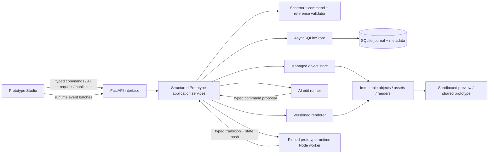
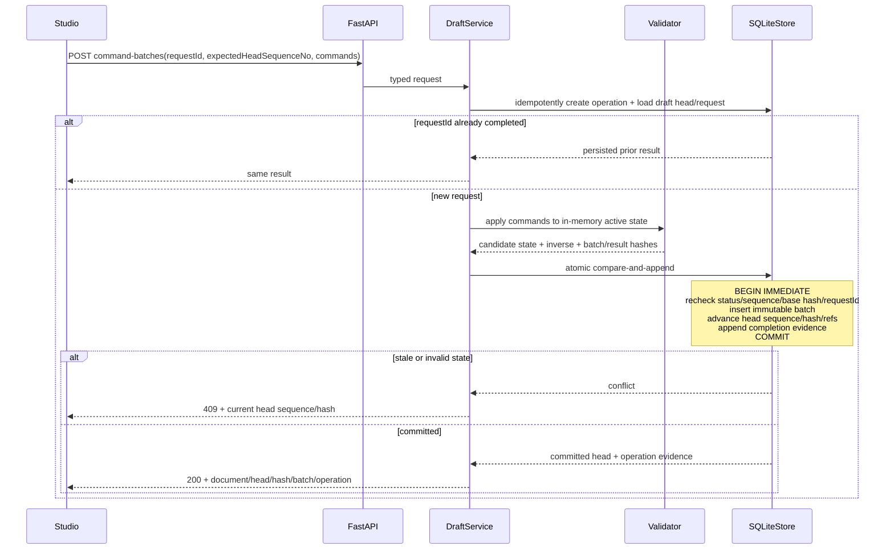
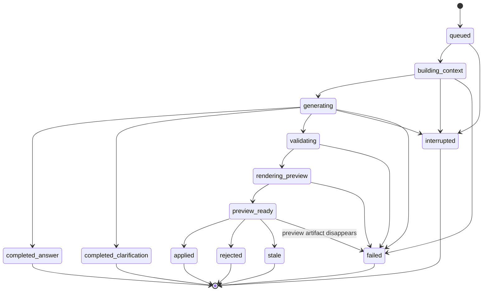
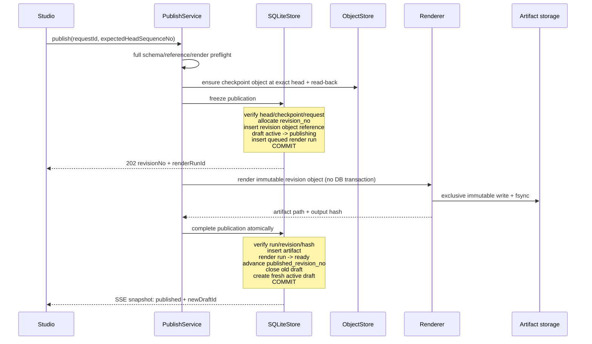

# 结构化原型编辑器后端设计

## 1. 结论

后端采用“进程内活跃状态 + SQLite 单调命令日志/元数据 + managed object store 不可变 checkpoint + 派生渲染产物”的模型：

- `PrototypeDocument` 是业务聚合根，包含页面、组件、共享导航、可执行业务规则和确定性场景。
- 完整结构化文档以 canonical JSON 计算内容哈希，压缩后保存为不可变 content-addressed object；SQLite 只保存对象 descriptor、checkpoint 引用和命令日志。
- 活跃草稿在进程内保持已验证的物化状态，崩溃后从最近 checkpoint 加有界命令 tail 确定性恢复。内存状态是缓存，不是事实来源。
- HTML/CSS/JS 只由固定版本的渲染器生成，不参与后续编辑，也不作为事实来源。
- 拖拽、属性编辑和 AI 修改使用同一套领域命令；一个批次要么全部成功，要么全部拒绝。
- AI 先生成提案和隔离预览，用户点击“应用”后才写入草稿；点击“发布”后才形成不可变修订和可分享产物。
- 发布只有在渲染产物校验通过后才推进公开指针。AI、渲染或数据库失败时，旧的已发布版本始终可用。
- 所有会产生业务效果的步骤先持久化 operation/step identity、输入 hash 和固定版本，结束时保存输出 hash、error code 与完成证据；没有证据不能声称成功。
- Prototype preview 的业务状态也不是浏览器临时黑盒：recorded runtime session 固定 document/scenario/core 版本，追加 semantic events 和 state hashes，并可确定性恢复。

这不是把现有 `PrototypeVersion.html` 换成一个更大的 JSON 字段，也不是把大型 JSON 移到 Git 项目目录。完整存储和恢复契约见 [`checkpoint-journal-design.md`](checkpoint-journal-design.md)，全链路证据与复现契约见 [`observability-reproducibility-design.md`](observability-reproducibility-design.md)，精确 command/HTTP/MCP/renderer 边界见 [`executable-contracts.md`](executable-contracts.md)，业务状态和演示重放见 [`prototype-runtime-design.md`](prototype-runtime-design.md)。旧 HTML 原型在后续实现阶段通过独立入口共存，本设计不承担历史迁移。

## 2. 系统边界



职责划分：

| 层 | 责任 | 不负责 |
|---|---|---|
| Interface | 严格解析 HTTP/SSE 请求与响应，映射 typed error | 文档语义、SQL、渲染 |
| Application | 命令执行、状态机、上下文裁剪、发布编排、完整文档校验 | 直接写 SQL |
| Domain | 行模型、状态类型、领域错误、合法状态迁移 | HTTP 形状 |
| Adapter/store | SQL、事务、乐观锁、幂等、行到模型转换 | 重新解释业务命令 |
| Object store | canonical object 压缩、不可覆盖写、fsync、read-back、内容寻址 | 分配业务 sequence 或决定工作流状态 |
| Renderer | 从指定 schema 和 renderer 版本确定性地产生静态产物 | 修改源文档 |
| Runtime core | 对固定 document/scenario/state/event 执行 typed guard/effect 并产生 transition/state hash | SQL、网络、文件、真实认证、任意脚本 |

## 3. 必须长期成立的不变量

1. 一个文档实体和每个 UI 节点都使用稳定、不透明的 ID；渲染器不得重新生成 ID。
2. 已发布修订引用的 `document_object_hash`、`document_hash` 和 `schema_version` 永不修改；完整文档不保存在 revision/draft SQLite JSON 列。
3. 同一文档最多存在一个 `active` 或 `publishing` 草稿；MVP 不做多人实时协作。
4. 所有草稿变更都携带 `expected_head_sequence_no`；sequence 或 base document hash 不一致返回冲突，不自动覆盖。
5. 同一个 `client_request_id` 在同一个草稿中最多产生一个命令批次；重试返回首次结果。
6. 删除节点、页面、组件定义或资源时，只要仍有入站引用，整个命令批次就被拒绝。
7. AI 只能提交领域命令，不能提交整份替换文档，也不能绕过命令校验器。
8. Claude task/process、文件写入、浏览器渲染和其他长耗时操作不持有 SQLite 事务。
9. `published_revision_no` 只在已验证渲染产物落库的同一个事务中推进。
10. 发布失败、AI 失败或服务重启都不能清空草稿，也不能改变上一个公开修订。
11. 命令批次只追加，sequence 严格连续；Undo/Redo 追加补偿/重放批次，不修改历史行。
12. object 必须先完成不可覆盖写、fsync、read-back 和 hash/schema 校验，SQLite 才能创建引用。DB 失败留下安全 orphan，由 GC 回收。
13. checkpoint 后命令 tail 不得超过 200 个批次；缺 sequence、对象损坏、版本不支持或任一 hash 不一致都将 draft 标为 `corrupt` 并拒绝继续。
14. 每个 mutation、AI、render、recovery 和 GC 步骤都必须有 durable operation/step evidence；每次成功状态变更必须有 replay manifest，副作用前失败必须有 durable failure evidence。普通日志和 Agent trajectory 不构成完成证据。
15. Flow edge 只能引用 `BehaviorRule`；Flow 坐标和展示节点不决定执行行为，不能形成第二份业务规则。
16. Studio/recorded runtime session 固定 document object hash、scenario hash 和 runtime core bundle hash；已开始 session 不跟随 draft 漂移。
17. 浏览器和后端重放使用同一个 TypeScript runtime core。Python 只调用 strict Node worker contract，不实现第二套 predicate/effect evaluator。

## 4. 领域对象

### 4.1 PrototypeDocumentRecord

文档聚合的轻量元数据：

```text
id
project_id
title
published_revision_no | null
created_at
updated_at
```

一个项目允许存在多个文档，例如“采购后台主方案”和“审批流程备选方案”。产品首版默认打开最近更新的文档，但数据库不对 `project_id` 加唯一约束。

### 4.2 PrototypeDocument

这是 JSON 事实模型，由 application 层的 Pydantic v2 discriminated union 校验：

```text
schemaVersion
settings
tokens
componentDefinitions[]
pages[]
navigation
flows[]
runtime
assetRefs[]
```

页面根节点和子节点只允许类型化属性与类型化布局值。Runtime 包含 roles、variables、mock entity schemas、forms、typed behavior rules 和 deterministic scenarios。业务流程的边引用 behavior rule ID，不在 HTML 中嵌 URL 或表达式脚本。

整份文档以 canonical JSON 计算 SHA-256：UTF-8、对象键排序、无无意义空白。哈希用于产物一致性与诊断，整数版本仍是并发控制依据。

### 4.3 PrototypeRevision

已接受发布尝试的不可变引用：

```text
id
document_id
revision_no
schema_version
checkpoint_id
document_object_hash
document_hash
summary
source: user | ai | initial_generation
created_at
```

完整文档位于 managed object store，revision 不复制 JSON。修订存在不代表已公开。是否公开由 `prototype_documents.published_revision_no` 唯一决定；渲染失败的修订保留用于诊断和安全重试，但不会出现在分享链接中。

### 4.4 PrototypeDraft

```text
id
document_id
base_revision_no | null
status: active | publishing | closed | corrupt
head_sequence_no
head_document_hash
latest_checkpoint_id
publish_revision_no | null
created_at
updated_at
closed_at | null
```

- 创建新文档时，先写入空白或 AI generation candidate object，再创建 `base_revision_no=null`、sequence `0` 的初始 checkpoint 和 active draft。
- 每次成功命令将 `head_sequence_no + 1`；它是唯一并发版本。
- `publishing` 期间拒绝编辑，避免渲染过程中草稿继续漂移。
- 发布成功后关闭旧草稿，并基于 revision object 原子创建一个新的 `active` 草稿。新草稿从 sequence `0` checkpoint 开始，Undo/Redo 时间线也重新开始。
- 发布失败后将原草稿恢复为 `active`，完整内容不变。

### 4.5 PrototypeCommandBatch

```text
id
draft_id
base_sequence_no
result_sequence_no
client_request_id
origin: user | ai | system
operation_kind: forward | undo | redo
target_batch_id | null
command_contract_version
commands_json
inverse_commands_json
command_batch_hash
base_document_hash
result_document_hash
operation_id
summary
created_at
```

领域命令首版固定为：

- `insertNode`
- `moveNode`
- `removeNode`
- `duplicateNode`
- `setNodeProperty`
- `setNodeLayout`
- `reorderPage`
- `updateNavigation`
- `replaceCodeBlockPayload`
- `add|replace|removeRuntimeRole`
- `add|replace|removeRuntimeVariable`
- `add|replace|removeMockEntitySchema`
- `add|replace|removeRuntimeForm`
- `add|replace|removeRuntimeViewBinding`
- `add|replace|removeRuntimeScenario`
- `add|replace|removeBehaviorRule`
- `bindNodeRuntimeField` / `unbindNodeRuntimeField`
- `setRuntimeFlowNodePosition`

Flow 连线通过 `addBehaviorRule` 创建，删除连线通过 `removeBehaviorRule` 完成，不维护独立 interaction edge。命令不是 RFC 6902 JSON Patch。命令包含明确的业务意图，校验器可以判断容器约束、runtime 类型/引用完整性和 CodeBlock 边界。

`inverse_commands_json` 在批次首次应用时由服务端计算，不接受客户端提供。批次行不可变且 `result_sequence_no = base_sequence_no + 1`。Undo 追加一个引用目标 batch 的补偿批次；Redo 追加一个重放批次。Undo 后提交普通 forward batch 会形成新分支，使旧 Undo 不再可 Redo，但不修改任何历史状态。

### 4.6 PrototypeAiEditRun

```text
id
document_id
draft_id
thread_id
user_message_id
client_request_id
base_revision_no | null
base_sequence_no
base_document_hash
status
instruction
selection_json
context_manifest_object_hash
outcome_kind: answer | clarification | command_proposal | null
summary | null
assistant_message | null
commands_json | null
command_batch_hash | null
candidate_object_hash | null
candidate_document_hash | null
preview_render_run_id | null
attempt
error_code | null
error_message | null
started_at | null
completed_at | null
created_at
updated_at
```

候选文档持久化为不可变 object 是有意的：用户刷新页面后仍能看到同一份提案；应用时必须证明 proposed commands 在 base hash 上得到的 result hash 等于 previewed candidate object hash，而不是重新执行 Agent task。

### 4.7 PrototypeRenderRun 与 PrototypeRenderArtifact

RenderRun 是可失败、可重试的工作记录：

```text
id
document_id
kind: ai_preview | publication
revision_id | null
ai_edit_run_id | null
status: queued | rendering | ready | failed | interrupted
renderer_version
render_runtime_image_hash
browser_version
font_pack_hash
viewport_profile_hash
document_object_hash
document_hash
operation_id
attempt
artifact_id | null
error_code | null
error_message | null
started_at | null
completed_at | null
created_at
updated_at
```

RenderArtifact 是不可变产物记录：

```text
id
render_run_id
document_id
revision_id | null
renderer_version
document_hash
output_hash
storage_key
visual_preflight_report_hash
created_at
```

发布产物写到应用 managed data root：

```text
<data_root>/projects/<project-id>/prototype-store/renders/<document-id>/<artifact-id>/index.html
```

继续复用现有 artifact writer 的路径包含检查、拒绝 symlink、UTF-8、独占创建和落盘后 fsync 规则。将产物导出到源码项目目录是独立衍生操作，不是 canonical storage。

### 4.8 PrototypeAsset

```text
id
project_id
content_hash
media_type
byte_size
original_name
storage_key
created_at
```

- 二进制按 SHA-256 寻址，`UNIQUE(project_id, content_hash)` 去重。
- 文档 JSON 只保存 asset ID 和展示元数据，不嵌 base64。
- `prototype_asset_references` 为 draft、revision 和 ai_preview 维护引用索引；删除资源时只要存在引用就拒绝。
- MVP 接受 PNG、JPEG 和 WebP。SVG 在具备可靠清洗和 CSP 之前拒绝上传。

### 4.9 PrototypeObject 与 PrototypeCheckpoint

完整字段、canonicalization、压缩和写入顺序由 [`checkpoint-journal-design.md`](checkpoint-journal-design.md) 锁定。总后端只依赖两个边界：

```text
PrototypeObject
  content_hash
  project_id
  media_type
  codec version
  canonical/stored byte sizes
  storage_hash
  storage_key

PrototypeCheckpoint
  id
  document_id
  draft_id | null
  revision_id | null
  checkpoint_kind
  checkpoint_sequence_no
  document_object_hash
  document/command contract versions
  created_by_operation_id
```

object 成功写入、fsync、read-back、解压和校验后，短事务才注册 object/checkpoint/reference。相反顺序会制造悬空数据库引用，禁止实现。

### 4.10 PrototypeOperation evidence

每个产生业务效果的入口创建 `PrototypeOperation`，每个外部或确定性边界创建 `PrototypeOperationStep`，状态变化追加 `PrototypeOperationEvent`。成功 operation 必须引用 `PrototypeReplayManifestV1`，否则不能标记 `succeeded`；在 object 可用前失败的 operation 保存 bounded failure evidence hash 和 step/event error，不产生业务效果。

这些记录至少覆盖 request/context/source/prompt/contract/runtime profile/checkpoint/sequence/command/renderer/output/validation 的 hash 和版本。详细字段和步骤矩阵见 [`observability-reproducibility-design.md`](observability-reproducibility-design.md)。

## 5. SQLite 表设计

| 表 | 主要职责 | 关键约束/索引 |
|---|---|---|
| `prototype_documents` | 聚合元数据与公开指针 | `PK(id)`, index(project_id, updated_at) |
| `prototype_document_revisions` | 不可变 document object/checkpoint 引用 | `UNIQUE(document_id, revision_no)`, index(document_id, document_hash) |
| `prototype_drafts` | active head sequence/hash/checkpoint 元数据 | partial unique index：每个 document 仅一个 active/publishing |
| `prototype_checkpoints` | sequence 到完整 document object 的不可变恢复点 | `UNIQUE(draft_id, checkpoint_sequence_no)`, revision 一一对应 |
| `prototype_command_batches` | 单调、不可变 commands/inverse/补偿历史 | `UNIQUE(draft_id, result_sequence_no)`, `UNIQUE(draft_id, client_request_id)` |
| `prototype_objects` | managed byte/object descriptor，不绑定业务 schema | `PK(project_id, content_hash)`, `UNIQUE(storage_key)` |
| `prototype_object_references` | 项目内 object 的 role/payload/schema 引用与 GC live set | `PK(project_id, owner_kind, owner_id, role, content_hash, payload_type, schema_version)` |
| `prototype_ai_threads` | 文档级持久化对话 | index(document_id, updated_at) |
| `prototype_ai_messages` | 用户/助手可见消息和 run/batch 关联 | `UNIQUE(thread_id, client_message_id)` for user messages |
| `prototype_ai_edit_runs` | AI 提案和 context/candidate object 引用 | `UNIQUE(draft_id, client_request_id)`, partial unique：每个 draft 仅一个 active run |
| `prototype_document_generation_jobs` | 首次生成请求、蓝图和候选 object 引用 | `UNIQUE(project_id, client_request_id)` |
| `prototype_document_generation_runs` | 冻结蓝图的一次生成尝试 | index(job_id, created_at) |
| `prototype_document_generation_run_items` | foundation/page 独立输出与运行证据 | `UNIQUE(run_id, kind, item_key)` |
| `prototype_document_generation_blueprint_batches` | 待确认蓝图的命令历史 | `UNIQUE(job_id, sequence_no)`, `UNIQUE(job_id, client_request_id)` |
| `prototype_render_runs` | 预览/发布渲染状态 | index(document_id, status), publication target idempotency index |
| `prototype_render_artifacts` | 不可变文件元数据 | `UNIQUE(render_run_id)`, `UNIQUE(storage_key)` |
| `prototype_assets` | 内容寻址资源 | `UNIQUE(project_id, content_hash)` |
| `prototype_asset_references` | 资源反向引用 | `PK(asset_id, owner_kind, owner_id, node_id)` |
| `prototype_mutation_requests` | 发布、undo、redo 等非命令操作的幂等结果 | `UNIQUE(scope_kind, scope_id, client_request_id)` |
| `prototype_ingress_attempts/events` | 所有 prototype HTTP 请求的接收、认证、解析和响应证据 | `UNIQUE(correlation_id)`, append-only event sequence |
| `prototype_operations` | 跨入口 durable operation 摘要 | `UNIQUE(scope, client_request_id)`, index(resource, created_at) |
| `prototype_operation_steps` | 每一步的状态、版本、输入输出 hash | `UNIQUE(operation_id, step_ordinal, attempt)` |
| `prototype_operation_events` | append-only 状态与证据事件 | `PK(operation_id, event_no)` |
| `prototype_gc_runs/items` | live-set、候选、删除或保留证据 | index(status, created_at), unique(run_id, content_hash) |
| `prototype_runtime_sessions` | 固定 document/scenario/core 的运行时会话 head | index(document_id, created_at), index(status, updated_at) |
| `prototype_runtime_event_batches` | 单调 semantic events、rule/guard/effect/state hashes | `UNIQUE(session_id, result_sequence_no)`, `UNIQUE(session_id, client_event_id)` |
| `prototype_runtime_checkpoints` | sequence 到完整 runtime-state object 的恢复点 | `UNIQUE(session_id, checkpoint_sequence_no)` |

SQLite 中受限大小的 command、selection、visible message 和状态 JSON 以 TEXT 保存，读出后必须先通过 application 层模型校验。完整 document、context manifest、generation item 和 candidate JSON 只保存 object reference。SQL 只写在 `AsyncSQLiteStore`。首版设置以下可配置上限，读取入口统一放在 `application/timeouts.py` 的 typed accessor 中：

- 单个 prototype document canonical object：2 MiB。
- 单命令批次：最多 100 条命令、序列化后最多 256 KiB。
- 单资源：10 MiB；单文档资源总量：100 MiB。
- checkpoint 间隔：30 秒 dirty 或 50 batches；replay tail 硬限制 200 batches。

2 MiB 是首版 schema/渲染/传输安全上限，不是把 JSON 放入 SQLite 的理由。未来超过该规模时才考虑页面级 object/chunk；首版保持一个完整 document object 加命令日志。

## 6. 草稿命令流程



校验在写事务前完成，事务内再次检查 sequence、base hash 和状态。这样既不长时间占用写锁，也不会因两个标签页或两个进程同时编辑而覆盖数据。SQLite 事务不重写完整 document；成功后进程内 active state 前移，缓存丢失时按 checkpoint + journal 恢复。

拖拽只是 drop 时提交的一个最终 `moveNode` 或 `reorderPage`，mousemove 不持久化。前端可以先乐观显示，服务端拒绝后必须回到返回的权威 document/head，不允许静默保留未落库状态。

Undo/Redo 走同一个 compare-and-append 边界。服务端计算目标和命令，分别追加 `operation_kind=undo|redo` 的新批次；历史批次永不改状态。Checkpoint 的触发、硬限制和恢复算法以 [`checkpoint-journal-design.md`](checkpoint-journal-design.md) 为准。

## 7. AI 编辑流程

首次生成、对话线程、项目 UI Engineer 任务协议、严格输出契约、预算和修复策略的完整设计见 [`ai-generation-design.md`](ai-generation-design.md)。本节只定义 AI 提案写入草稿时必须遵守的公共事务边界。

### 7.1 上下文构造

AI 默认只接收：

- 当前页面的结构摘要。
- 选中节点子树。
- 相关组件定义和 design tokens。
- 直接连接的流程目标。
- 当前 viewport 和用户指令。

冻结 context manifest 作为 immutable object 保存，run 只记录 object hash。它包含被纳入上下文的实体 ID/内容 hash、base sequence/document hash、schema/command/context-builder/prompt 版本和 source fingerprint。完整项目不默认进入 prompt。

产生修改时，项目绑定的 Claude Code `prototype_ui_engineer` 通过 scoped MCP 提交一个严格结果：

```json
{
  "contractVersion": 1,
  "summary": "将采购申请按钮移动到筛选区下方并改为主按钮",
  "commands": []
}
```

UI Engineer 也可以提交不改文档的 `answer` 或 `clarification` outcome，完整 union 见详细设计。只有匹配的 `CodexTask`/execution process 成功终态，加上唯一、完整且严格校验的 scoped MCP 结果或 staging manifest，才能证明成功。进程异常结束、输出截断、多个结果、未知命令或引用不存在都进入 `failed`，不得用宽松修复补全缺失结构。

### 7.2 状态机



### 7.3 应用提案

`POST /api/prototype-ai-edit-runs/{run_id}/apply` 必须携带 `client_request_id` 和 `expected_head_sequence_no`。Apply 前，candidate object 已完成 immutable write/read-back，preview artifact 已记录其 document hash。Store 在一个 `BEGIN IMMEDIATE` 中：

1. 校验 run 仍为 `preview_ready`。
2. 校验草稿仍为 `active`，且 head sequence/hash 等于 run 的 base sequence/hash。
3. 校验 proposed batch hash、candidate object hash 和 preview document hash 一致。
4. 插入一个 `origin=ai`、`operation_kind=forward` 的 immutable 命令批次和服务端 inverse。
5. 更新草稿 head sequence/hash 和资源引用，并把 candidate object 注册为 result sequence 的 checkpoint。
6. 将 run/message 标记为 `applied`，追加 operation completion evidence 和 replay manifest 引用。
7. 提交。

任何一步失败都回滚整个事务。如果用户在 AI 生成期间已经做了其他编辑，run 标记为 `stale` 并返回 409；首版不自动 rebase，用户可基于最新选择重新发起请求。

## 8. 发布与渲染流程



发布分成两个短事务，中间的渲染不占 SQLite 锁：

### 8.1 Freeze publication

- 确保当前 head sequence/hash 有经过 read-back 的 checkpoint object；写对象在事务外完成。
- 再次校验 `expected_head_sequence_no`、checkpoint hash 和幂等请求。
- 分配 `MAX(revision_no)+1`，写入不可变 revision/checkpoint/object reference，不复制完整 JSON。
- 草稿从 `active` 变成 `publishing` 并记录目标 revision。
- 创建 `queued` render run。
- 同一事务提交。

### 8.2 Render

- renderer 只读取 revision 固定的 document object，并重新校验内容 hash。
- renderer 版本固定在 run 上，不读取“当前最新版”配置。
- render runtime image、browser、font pack 和 viewport profile 都固定并记录 hash；视觉 preflight 只有在同一环境契约下才要求 pixel/hash 可复现。
- HTML 在 sandbox/CSP 规则下生成，CodeBlock 在隔离 iframe 中运行，不能访问宿主页、cookie 或任意网络。
- 文件成功后计算 output SHA-256。

### 8.3 Complete publication

- 原子写入 artifact、标记 render run ready、推进公开修订指针。
- 关闭发布草稿；命令批次保持不可变，不增加 `committed` 状态。
- 基于同一 revision object 创建 sequence `0` checkpoint 和新的 active draft。

如果渲染失败：render run 标为 `failed`，原草稿恢复 `active`，公开指针不变。相同内容可以显式重试同一修订；如果草稿已经继续修改，则拒绝重试旧修订并要求重新发布。

## 9. API 契约

所有写请求使用严格 Pydantic 模型，禁止 `dict[str, object]` 作为新接口请求体。日期统一 ISO-8601；JSON 字段返回结构化对象，不把数据库 TEXT 直接透传。

### 9.1 文档与草稿

| Method | Path | 作用 |
|---|---|---|
| `POST` | `/api/projects/{project_id}/prototype-documents` | 创建文档和首个 active draft |
| `GET` | `/api/projects/{project_id}/prototype-documents` | 文档列表元数据 |
| `GET` | `/api/prototype-documents/{document_id}` | 文档元数据、公开修订、active draft 摘要 |
| `GET` | `/api/prototype-documents/{document_id}/revisions/{revision_no}` | 获取不可变结构化修订 |
| `GET` | `/api/prototype-drafts/{draft_id}` | 获取完整草稿快照 |
| `POST` | `/api/prototype-drafts/{draft_id}/command-batches` | 原子应用用户命令 |
| `POST` | `/api/prototype-drafts/{draft_id}/undo` | 撤销最后批次 |
| `POST` | `/api/prototype-drafts/{draft_id}/redo` | 重做下一批次 |
| `POST` | `/api/prototype-drafts/{draft_id}/publish` | 冻结修订并启动渲染 |

命令成功响应至少包含：

```json
{
  "contractVersion": 1,
  "operationId": "op-...",
  "draftId": "draft-...",
  "headSequenceNo": 12,
  "documentHash": "sha256:...",
  "appliedBatchId": "batch-...",
  "document": {}
}
```

首版仍可从进程内状态或 checkpoint + journal 恢复后返回完整文档，保证冲突恢复简单可靠；“返回完整文档”不等于“SQLite 存完整文档”。文档接近 2 MiB 上限后再引入按页增量读取。

### 9.2 AI 编辑

| Method | Path | 作用 |
|---|---|---|
| `POST` | `/api/prototype-documents/{document_id}/ai-threads` | 创建文档级持久化对话 |
| `GET` | `/api/prototype-documents/{document_id}/ai-threads` | 列出文档的对话线程 |
| `GET` | `/api/prototype-ai-threads/{thread_id}` | 获取 thread 和可见 messages |
| `POST` | `/api/prototype-ai-threads/{thread_id}/messages` | 原子创建用户消息和 AI edit run，返回 202 |
| `GET` | `/api/prototype-ai-edit-runs/{run_id}` | 获取完整任务快照 |
| `GET` | `/api/prototype-ai-edit-runs/{run_id}/events` | SSE snapshot + heartbeat |
| `POST` | `/api/prototype-ai-edit-runs/{run_id}/apply` | 原子应用已预览提案 |
| `POST` | `/api/prototype-ai-edit-runs/{run_id}/reject` | 拒绝提案，不改草稿 |
| `POST` | `/api/prototype-ai-edit-runs/{run_id}/retry` | 从 failed/interrupted 新建一次尝试 |

### 9.3 渲染、分享与资源

| Method | Path | 作用 |
|---|---|---|
| `GET` | `/api/prototype-render-runs/{run_id}` | 获取渲染快照 |
| `GET` | `/api/prototype-render-runs/{run_id}/events` | SSE snapshot + heartbeat |
| `POST` | `/api/prototype-render-runs/{run_id}/retry` | 显式重试失败/中断渲染 |
| `GET` | `/api/prototype-documents/{document_id}/published` | 返回当前公开修订与产物元数据 |
| `POST` | `/api/projects/{project_id}/prototype-assets` | 上传并按内容去重 |
| `DELETE` | `/api/prototype-assets/{asset_id}` | 无引用时删除 |

### 9.4 Operation 与复现

| Method | Path | 作用 |
|---|---|---|
| `GET` | `/api/prototype-operations/{operation_id}` | 获取 operation、steps、版本、hash、错误和 replay manifest 摘要 |
| `GET` | `/api/prototype-operations/{operation_id}/events` | 获取 append-only durable event sequence |
| `POST` | `/api/prototype-operations/{operation_id}/diagnostic-replays` | 创建隔离诊断重放；不修改 active draft |
| `GET` | `/api/prototype-diagnostic-replays/{replay_id}` | 获取 hash 比对、首个分歧步骤和结构化 diff |

### 9.5 业务运行时

| Method | Path | 作用 |
|---|---|---|
| `POST` | `/api/prototype-documents/{document_id}/runtime-sessions` | 固定 source/scenario/core 并创建 sequence 0 session |
| `GET` | `/api/prototype-runtime-sessions/{session_id}` | 获取 authoritative runtime state/head 和 session metadata |
| `POST` | `/api/prototype-runtime-sessions/{session_id}/event-batches` | 原子执行并追加 semantic event batch |
| `POST` | `/api/prototype-runtime-sessions/{session_id}/reset` | 关闭旧 session 并创建新的 scenario session |
| `POST` | `/api/prototype-runtime-sessions/{session_id}/complete` | checkpoint 并关闭 recorded session |
| `GET` | `/api/prototype-runtime-sessions/{session_id}/events` | 获取 typed transitions 或 SSE snapshots |
| `POST` | `/api/prototype-runtime-sessions/{session_id}/diagnostic-replays` | 隔离重放并逐 event/effect 比较 hashes |

分享页只读取 `published_revision_no` 对应的 ready artifact，从不读取 active draft 或失败修订。

### 9.6 错误映射

| 状态码 | 场景 |
|---|---|
| `400` | 领域命令不合法、引用完整性失败、状态迁移不合法 |
| `404` | 文档、草稿、run、revision 或 asset 不存在 |
| `409` | draft/session head sequence/hash 冲突、重复 active draft、提案 stale、发布状态冲突 |
| `413` | 文档、命令批次或资源超过上限 |
| `422` | HTTP 请求结构不符合 Pydantic 契约 |
| `503` | AI、renderer、object/observability store 或治理门不可用；动作被拒绝 |

409 响应必须带 `currentHeadSequenceNo`、`currentDocumentHash` 和重新获取草稿的 URL。内部错误不把 traceback 或 Agent 原始输出返回前端。

## 10. SSE 与恢复

AI 和 render SSE 沿用现有 prototype generation 的可靠模式：

- 只发送完整、经过 response model 校验的 `snapshot` 和带 `resource_id` 的 `heartbeat`。
- event ID 使用 durable `<operation-id>:<event-no>`；重复 event 不重复应用。
- 前端先 GET 当前快照，再连 SSE。SSE 静默超时后进行有次数和总时长上限的 GET 轮询。
- 每一帧先校验 contract version 和 resource identity，再更新 UI。
- 连接错误保留最后有效快照和未保存本地操作，显示明确错误，不清空页面。

后端启动恢复在一个 store 操作中完成：

1. `queued/building_context/generating/validating/rendering_preview` AI run 变为 `interrupted`。
2. `queued/rendering` render run 变为 `interrupted`。
3. 每个 active/publishing draft 从 latest checkpoint + bounded journal tail 执行确定性恢复，并持久化 replay report。
4. sequence 缺失、object/hash/version 不一致的 draft 进入 `corrupt`；不能为了恢复可用性跳过命令。
5. 指向中断 publication render 的合法 `publishing` 草稿恢复为 `active`；公开修订指针不变。
6. `preview_ready` AI run 保持可应用，但应用时仍校验 head sequence/hash；不一致则变为 `stale`。
7. active recorded runtime session 从 state checkpoint + event tail 重放；worker/core/version/hash 不一致则 session 进入 `corrupt`，不能跳过 event。

恢复不自动重复 Claude task/process。用户显式 retry 会创建新的 run 和新的 CodexTask，旧 run 保持终态，便于审计。

## 11. 事务与幂等清单

| 操作 | 单事务内容 | 事务外工作 |
|---|---|---|
| 创建文档 | document + initial checkpoint/object ref + draft + operation evidence | initial object 先写入并 read-back |
| 应用命令 | compare sequence/base hash + immutable batch + head/refs + request/result evidence | 命令应用和校验先在内存完成 |
| Undo/Redo | compare sequence + append compensation/replay batch + head/refs + result evidence | 服务端计算目标和 inverse |
| 创建 checkpoint | object/checkpoint/ref + latest pointer + step evidence | canonicalize/compress/write/fsync/read-back |
| 创建 AI run | 幂等检查 + queued row | context build + model + preview render |
| AI preview ready | run state + commands/hash + candidate object/preview refs + evidence | Claude task、object write 和文件渲染 |
| 应用 AI 提案 | run/base precondition + immutable batch + head/checkpoint refs + run applied + replay manifest | candidate object 已存在 |
| Freeze publish | request result + revision object/checkpoint ref + draft publishing + render run | head checkpoint 与完整校验已完成 |
| Complete publish | artifact + run ready + published pointer + close/open draft/checkpoint + evidence | 文件已写完并计算 hash |
| 上传资源 | asset row/idempotency | 文件 hash 与安全检查 |
| 创建 runtime session | source/scenario/core precondition + sequence-0 state checkpoint/ref + session + evidence | shared core 创建 initial state/object |
| 应用 runtime event | compare sequence/state hash + immutable event/transition + advance session head + evidence | pinned Node worker 计算 candidate transition/state |
| runtime checkpoint | state object/ref + checkpoint/latest pointer + evidence | canonicalize/compress/write/fsync/read-back |
| reset runtime | close old session + create new session/ref + request result | 新 initial state object 已验证 |

Store 方法是事务边界，service 不拼 SQL。所有多行操作使用 `BEGIN IMMEDIATE` 并在事务内重新检查状态。服务进程内的锁只减少重复工作，不承担正确性。

## 12. 失败闭合与安全边界

- AI 上下文构造失败、Claude runtime 不可用、Agent submission 非法、渲染器不可用、引用校验失败：动作拒绝，草稿不变。
- object/产物落盘成功但数据库提交结果不明确：按 operation/request ID 和 hashes 重新读取数据库进行确认；不能立即删除文件。未引用文件由两轮 mark-and-sweep GC 按保留期清理。
- CodeBlock 只能替换已选择 block 的 payload。命令校验器拒绝它修改宿主导航、运行时代码或其他节点。
- 预览采用独立 origin 或严格 sandbox iframe；禁止 `allow-top-navigation`、宿主 cookie、任意外部请求和未清洗 SVG。
- asset 路径由服务端生成，拒绝用户提供路径、`..`、绝对路径和 symlink。
- operation/step/event/replay manifest 记录 job/run/task/process ID、状态、时间、精确版本、输入/输出 hash、完成证据和错误码；默认不在 INFO 记录完整文档、task prompt、CodeBlock 或 Agent 原始输出。
- 观测证据存储不可用时不允许继续产生业务效果。Agent trajectory 只用于审计，不是 artifact authority。
- Runtime worker/core/version 不可用、event stale 或输出 hash 非法时不追加 runtime journal。Guard false 和 form validation failed 是 typed outcome，不伪装成系统异常。
- Runtime core 没有 network/filesystem/cookie/storage/host-command 权限；CodeBlock iframe 不能读写 host runtime state。

## 13. 与现有原型系统的关系

现有链路：

```text
Prototype -> PrototypeVersion(html) -> project-local index.html
```

新链路：

```text
PrototypeDocument(design + runtime rules) -> Draft(head + journal + checkpoint object) -> Revision(object ref) -> RenderArtifact(html + pinned runtime core)
                                                                                      -> RuntimeSession(state checkpoint + event journal)
```

首个生产实现不修改旧表语义，也不让一个 service 同时理解两种 version。建议使用新的模块：

```text
backend/app/domain/structured_prototype.py
backend/app/application/prototype_document_schema.py
backend/app/application/prototype_command_service.py
backend/app/application/prototype_ai_edit_service.py
backend/app/application/prototype_render_service.py
backend/app/application/prototype_object_store.py
backend/app/application/prototype_replay_service.py
backend/app/application/prototype_operation_service.py
backend/app/application/prototype_runtime_service.py
backend/app/application/prototype_runtime_worker.py
backend/app/interfaces/structured_prototypes.py
```

现有“按代码生成每个页面的 HTML”不能直接成为新文档的入口。新的 initial generation 采用蓝图、共享 foundation、独立页面结构化输出和服务端确定性组装，完整契约见 [`ai-generation-design.md`](ai-generation-design.md)。旧 HTML 不参与组装，也不进行反向解析。

## 14. 分阶段实施顺序

### Phase 1: Contracts 与风险验证

- Pydantic document/runtime schema、命令 union、canonical hash。
- 纯函数命令执行器、inverse command、引用完整性校验。
- Pin XState v5 exact version，完成 shared TypeScript runtime core/strict compiler spike。
- Browser 与 pinned Node worker 对 scripted procurement scenario 产生相同 state/view-model hashes；未通过不得进入 Phase 2。

### Phase 2: 对象存储与草稿 API

- managed object writer/read-back、checkpoint/replay 内核。
- SQLite journal/object reference/operation evidence 表、row dataclass、迁移和 store 事务。
- 文档/草稿读取、command batch、undo/redo。
- head sequence/hash 乐观并发、幂等、完整 document 响应。
- checkpoint scheduler、200-batch hard gate、恢复和 corruption UI 状态。
- 前端拖拽和属性面板接真实 API。

### Phase 3: 业务运行时会话与 Flow

- runtime session/event/checkpoint/replay API 与 Flow rule projection。
- Form/view bindings、场景/模拟角色切换、semantic event flush 和 inspector。

### Phase 4: 确定性 renderer 与发布

- document/runtime/schema 到 renderer/runtime-core version 的兼容矩阵。
- publication freeze/complete、artifact writer、固定 runtime bundle 和分享读取。
- render run SSE、失败恢复和重试。

### Phase 5: AI 编辑

- 上下文裁剪、严格工具输出、AI run 状态机。
- 隔离预览、Apply/Reject、stale 检测。
- 治理门、token/cost 上限、逐步 evidence 和 replay manifest。

### Phase 6: 资源与初始生成

- 内容寻址上传、统一对象引用索引、配额和两轮 GC。
- 按 `ai-generation-design.md` 把需求或项目分析结果生成成结构化首稿；不从旧 HTML 反向解析。

## 15. 最小测试矩阵

### 领域单测

- 每种命令的成功、inverse、非法容器、CodeBlock 越界和引用拒绝。
- 页面删除时 navigation/flow 入站引用阻止删除。
- canonical JSON hash 稳定，字段顺序不影响结果。
- 相同 checkpoint 和命令版本在干净进程中重放得到相同 final sequence/hash。
- Undo/Redo 追加补偿/重放批次且不修改任何历史行。

### Store/事务测试

- 两个 SQLite 连接并发写同一 draft，只有一个 head sequence 成功。
- 同一 request ID 重试不会重复应用。
- 任意中间 SQL 失败后 batch、draft head、object/asset refs 和 completion evidence 全部回滚。
- 并发发布分配唯一 revision number。
- render completion 失败不会推进 published pointer。
- AI apply 与用户编辑竞争时 AI run 变 stale，用户编辑保留。
- 两个客户端并发提交同一 runtime session，只有一个 state sequence 成功。
- Runtime worker 成功但 DB 失败不推进 session head；同 client event 对账不重复执行。

### API 契约测试

- 422/400/404/409/413/503 映射准确。
- response model 拒绝缺字段、未知状态和错误 contract version。
- SSE snapshot resource identity、heartbeat、重连和终态停止。

### 恢复与产物测试

- 重启将活动 AI/render work 标为 interrupted，并恢复 publishing draft。
- preview_ready 在重启后仍可查看，版本冲突时不能应用。
- artifact 路径逃逸、symlink、重复写、内容 hash 不一致均拒绝。
- object write 成功而 DB 失败只产生 GC 可回收 orphan；DB 不会引用未 read-back 的 object。
- checkpoint tail 超过 200、缺 sequence、object 损坏或 replay hash 不一致时 draft 进入 corrupt 并拒绝写入。
- 发布失败后分享 URL 继续返回上一个 ready artifact。
- 任意成功 operation 都能查询完整 steps/events/replay manifest；task 成功但 submission/evidence 缺失时仍失败。

### 业务运行时测试

- 浏览器 runtime bundle 与 backend pinned Node worker 对同一 fixture 产生相同 initial/transition/final state hashes。
- 相同 document/scenario/core/event sequence 重放得到相同 entity IDs、guard/effect reports 和 final state hash。
- Flow edge 与 BehaviorRule 一一关联；只移动 Flow 坐标不改变 runtime execution。
- Event tail 缺失、runtime state object 损坏、core bundle 不匹配或 effect hash 不一致时 session 进入 corrupt。
- Guard false/validation failed 记录 typed transition；任意脚本、网络 effect 和 CodeBlock host-state bridge 被拒绝。

## 16. 当前明确不做

- 多人实时协作、评论、审批和细粒度权限。
- CRDT/OT、离线合并和 AI 提案自动 rebase。
- 真实 API/数据库、真实认证授权、生产数据、任意脚本/表达式、完整 BPMN、定时器和并行网关。
- 任意 HTML 反向解析成结构化节点。
- 生产代码导出、Figma/Penpot 文件兼容、矢量编辑。
- 多人协作所需的 CRDT/OT、跨设备离线日志合并和页面级并行 journal。
- 页面级 object/chunk；首版 checkpoint 是完整 document object。

## 17. 设计验收门

开始生产实现前，以下决策视为锁定：

- 一个文档可以包含多个页面、共享导航和多个业务流程。
- 项目可以有多个文档，但同一文档只有一个 active/publishing 草稿。
- AI Apply 只进入草稿；显式 Publish 才生成公开修订。
- 首版采用完整 document 响应和 2 MiB object 上限，但 SQLite 不保存完整 document JSON。
- active state、SQLite 单调 journal 和 immutable compressed checkpoint 是唯一恢复模型；checkpoint tail 硬限制 200。
- Undo/Redo 追加补偿/重放批次，历史不可改写。
- canonical object 位于应用 managed data root，不位于源码项目目录；导出是衍生操作。
- 每个步骤都有 durable evidence，每个成功效果都有 replay manifest。确定性步骤必须 hash 一致；Claude 重跑是新 operation，只比较结果，不承诺相同输出。
- Flow edge 引用唯一 BehaviorRule；runtime variables/forms/mock entities/scenarios/rules 都属于 document 并参与 checkpoint/hash。
- 浏览器和后端使用同一 pinned TypeScript runtime core；recorded session 固定 document/scenario/core 并追加 semantic event/state hashes。
- 发布期间草稿短暂只读；渲染失败后自动恢复可编辑。
- 旧 HTML prototype 表不承担新结构化文档语义。

AI 策略已经锁定：需求生成、源码恢复和对话修改全部调用项目绑定的 Claude Code `prototype_ui_engineer`，分别使用 planning/foundation/page/conversation task protocol；每次请求创建新的 `CodexTask`、execution process 和隔离 worktree。严格结果通过 scoped MCP 或 staging manifest 提交，Claude Code 不直接写 active draft。后端不调用通用 LLM API，也不提供 fallback；Claude runtime 不可用时 fail closed。

业务运行时策略也已经锁定：浏览器与后端重放使用同一 versioned TypeScript runtime core，后端通过 pinned Node worker 执行，不在 Python 中实现第二套规则解释器。实现时只需配置 UI Engineer 的 Claude executor profile、runtime core worker/bundle artifact 和 renderer 进程版本；这些配置不能改变本文的数据模型、事务边界或 API 状态机。
